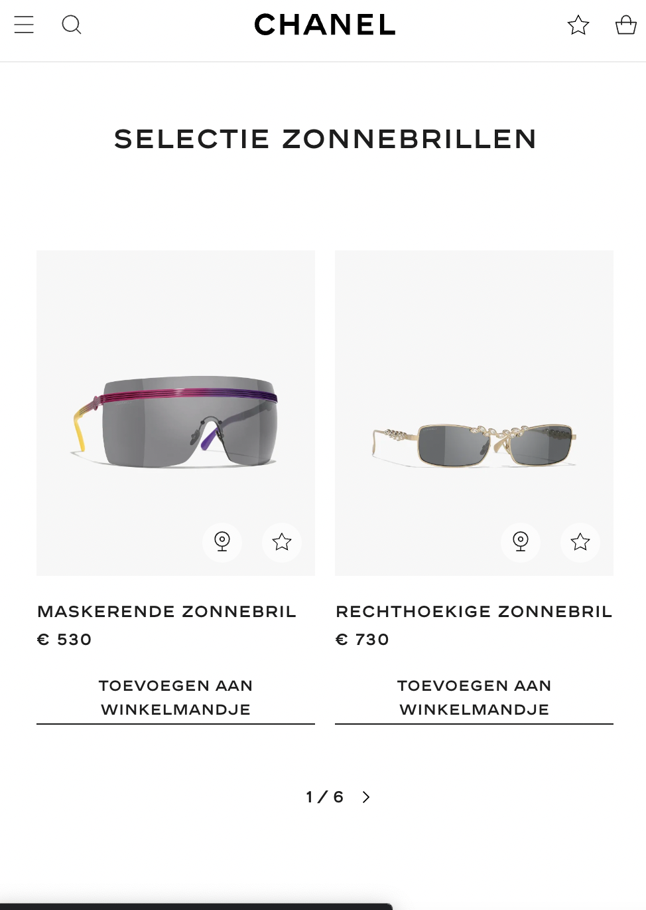
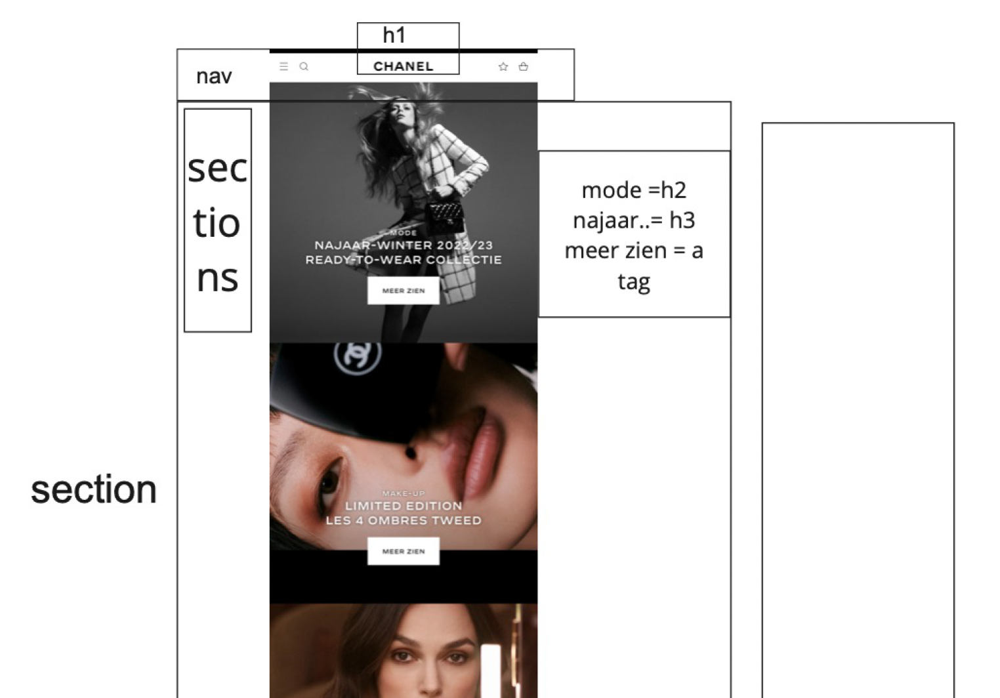
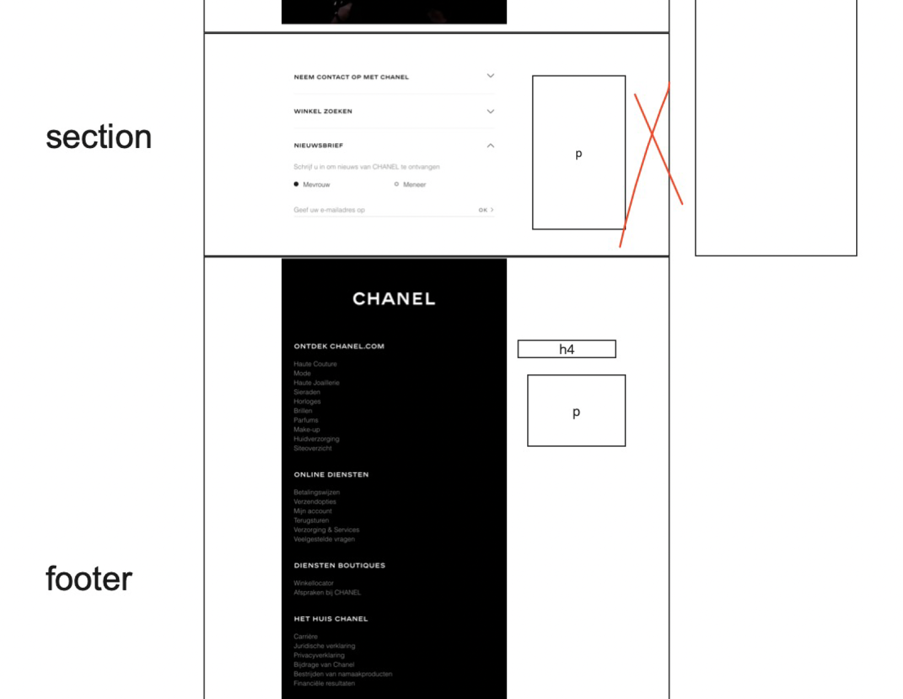
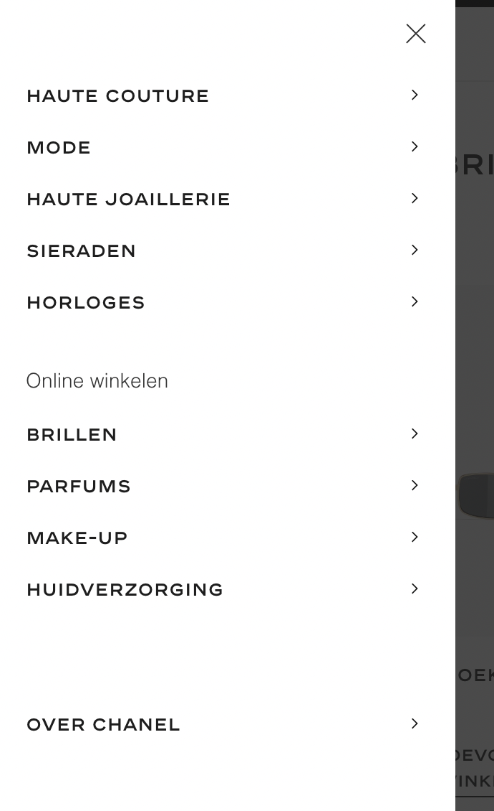
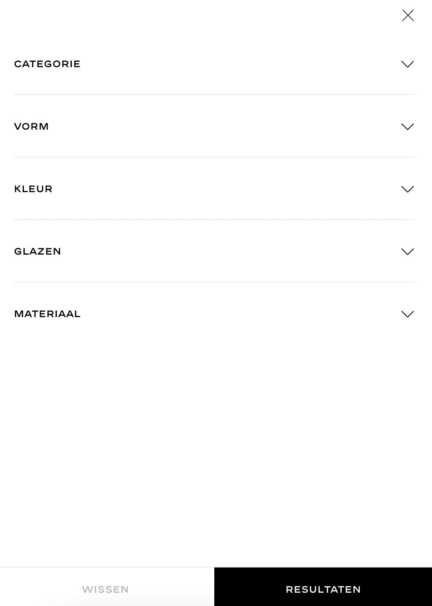
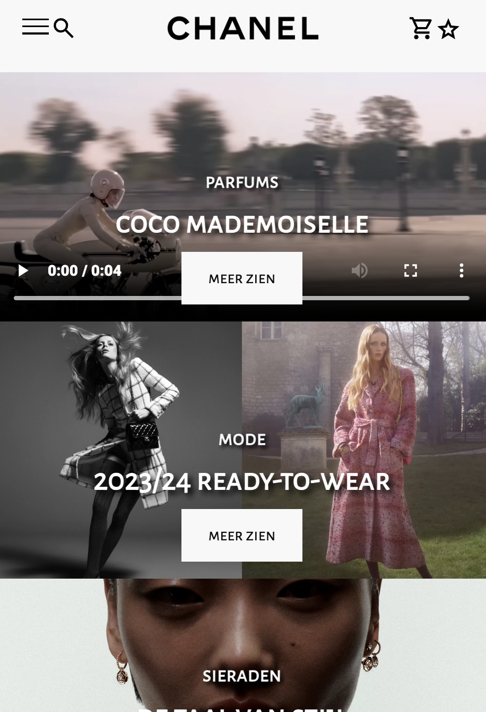
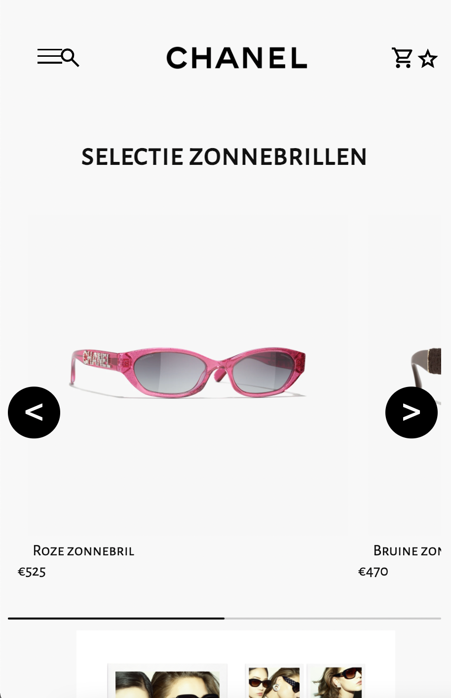
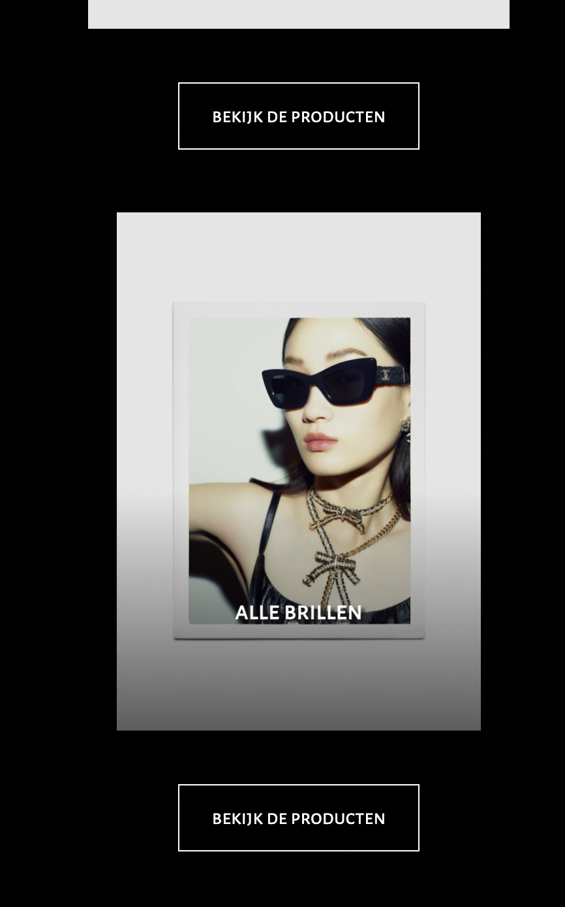
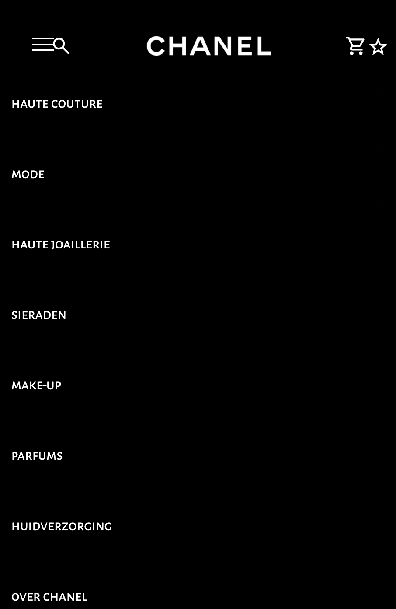
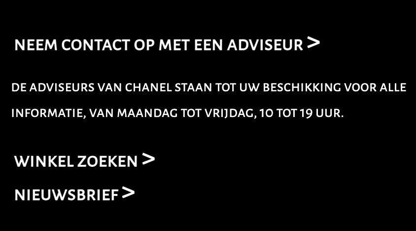

# Procesverslag
Markdown is een simpele manier om HTML te schrijven.  
Markdown cheat cheet: [Hulp bij het schrijven van Markdown](https://github.com/adam-p/markdown-here/wiki/Markdown-Cheatsheet).

Nb. De standaardstructuur en de spartaanse opmaak van de README.md zijn helemaal prima. Het gaat om de inhoud van je procesverslag. Besteedt de tijd voor pracht en praal aan je website.

Nb. Door *open* toe te voegen aan een *details* element kun je deze standaard open zetten. Fijn om dat steeds voor de relevante stuk(ken) te doen.

## Jij

  
uitwerken voor kick-off werkgroep

  ### Auteur:
Kayane
  #### Je startniveau:
Blauw
  #### Je focus:
surface plane  

## Je website

  
uitwerken voor kick-off werkgroep

  ### Je opdracht:
www.chanel.com/nl/
  #### Screenshot(s) van de eerste pagina (small screen): 
Homepage
  

  #### Screenshot(s) van de tweede pagina (small screen):
Brillen page
  
 

## Toegankelijkheidstest 1/2 (week 1)

  
uitwerken na test in 1e werkgroep

  ### Bevindingen
Het ontbreken van  states op de Chanel-website maakt het lastig voor gebruikers om te zien welke elementen klikbaar zijn. Zonder visuele feedback moeten gebruikers zich uitsluitend concentreren op de cursor. Het toevoegen van duidelijkere visuele feedback kan de algehele gebruiksvriendelijkheid van de website verbeteren.

De website heeft al wel een hoog contrast modus maar geen nacht modus,  de Chanel-website ontbreekt alt tekst op de afbeeldingenen dit vormt een uitdaging voor gebruikers met visuele beperkingen of voor hen die afhankelijk zijn van schermlezers. Zonder de beschrijvende tekst voor afbeeldingen, missen deze gebruikers essentiële informatie over de visuele inhoud van de site. 

  

## Breakdownschets (week 1)

  
uitwerken na afloop 2e werkgroep

  ### de hele pagina: 
  
  

  ### dynamisch deel (bijv menu): 
  

  ### wellicht nog een dynamisch deel (bijv filter): 
  

## Voortgang 1 (week 2)

  
uitwerken voor 1e voortgang

  ### Stand van zaken
 Het gebruik van drie CSS-pagina's was verwarrend voor mij in het begin, omdat ik hier niet eerder mee had gewerkt. Het vereiste wat tijd om aan te wennen. Ik heb erg moeite met javascript om het hamburger menu te openen.

  ### Agenda voor meeting
  samen met je groepje opstellen

  
  | Lisa           | Laura              | Sander            | Kayane           |
  | ---            | ---                | ---               | ---              |
  | nav bar        | 3 buttons stijl    | Margin en padding | Hamburger menu   |
  | css paginas    | haai met nummers   | Semantisch correct| Javascript       |
  | ...            | ...                | ...               | ...              |

  ### Verslag van meeting
  hier na afloop snel de uitkomsten van de meeting vastleggen

  - menu werkte niet door z-index
  

## Voortgang 2 (week 3)

  
uitwerken voor 2e voortgang

  ### Stand van zaken
  ik heb erg veel moeite met selectoren, vaak werkt het bij mij niet.

  ### Agenda voor meeting
 | Lisa           | Laura              | Sander             | Kayane           |
  | ---            | ---                | ---               | ---              |
  | animatie       | achtergrond en     | .....             | selectoren       |
  | slide bar in   | afbeeldingen bij h1| .....             | footer           |
  | loop aangeven  | inframe stylen     | ...               | ...              |

  ### Verslag van meeting
  hier na afloop snel de uitkomsten van de meeting vastleggen

  - position sticky op footer
  - hoe nth of type werkt
  
- ...

## Toegankelijkheidstest 2/2 (week 4)

  
uitwerken na test in 8e werkgroep

  ### Bevindingen
 Ik moet nog mijn html validaten, ik moet nog dark mode toevoegen en ik moet een heading toevoegen in mijn section.

## Voortgang 3 (week 4)

  
uitwerken voor 3e voortgang

  ### Stand van zaken
  hier dit ging goed & dit was lastig (neem ook screenshots op van delen van je website en code)

  ### Agenda voor meeting
  samen met je groepje opstellen

  | Kayane  1      | laura              | lisa         | sander           |
  | ---            | ---                | ---          | ---              |
  | accordion image | en dit             | en ik dit    | en dan ik dat    |
  |                 | dit als er tijd is | nog een punt | dit wil ik zeker |
  | ...            | ...                | ...          | ...              |

  ### Verslag van meeting

  - image in plaats van button gebruiken voor consistency.

## Eindgesprek (week 5)

  
uitwerken voor eindgesprek

  ### Je uitkomst - karakteristiek screenshots:
  
  

  ### Dit ging goed/Heb ik geleerd: 
Ik heb ontdekt hoe ik moet werken met de root selector en heb geleerd hoe je dark mode op een website kunt implementeren. Daarnaast heb ik kennis opgedaan over het creëren van een hamburgermenu met behulp van JavaScript.

  
    

  ### Dit was lastig/Is niet gelukt:
  Ik heb moeite gehad met het realiseren van een volledige uitklapmogelijkheid in de accordion, momenteel kan slechts één sectie tegelijk worden uitgeklapt. Daarnaast heb ik het lastig gevonden om de header van de brillenpagina op dezelfde manier te stylen als die van de homepagina. Een andere uitdaging was het toevoegen van een tweede slider voor optische brillen. het bleek complex om beide sliders op een functionele manier te stylen. Bovendien vond ik het moeilijk om rekening te houden met screenreaders en ervoor te zorgen dat de website goed functioneert voor gebruikers met visuele beperkingen.

  

## Bronnenlijst

  
continu bijhouden terwijl je werkt

  1. https://www.freecodecamp.org/news/html-button-link-code-examples-how-to-make-html-hyperlinks-using-the-href-attribute-on-tags/
  2. image slider  https://www.codingnepalweb.com/responsive-image-slider-html-css-javascript/
  3. heading verstoppen 
  4. accordion  https://www.youtube.com/watch?v=oCx4gtYe410 
  5. header scale, nina
  6. h1 verbergen, bahaa 
  7. header icons https://fonts.google.com/icons
  8. images https://chanel.com/nl/
  9. darkmode https://www.youtube.com/watch?v=9LZGB3OLXNQ&t=193s

